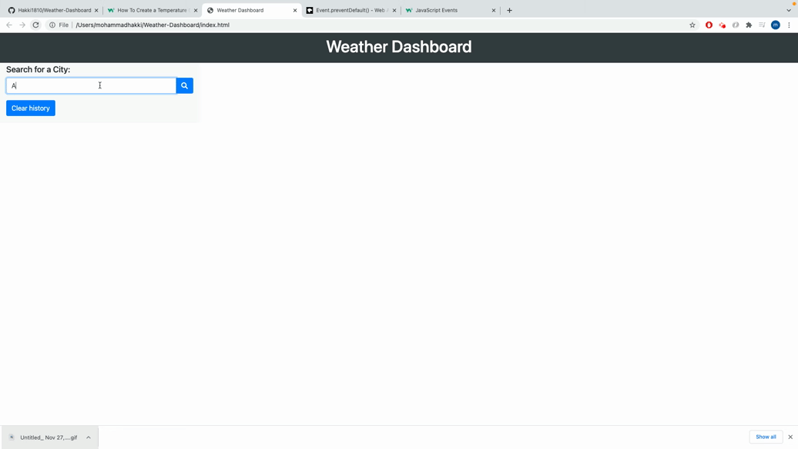

# Weather Dashboard

## Description

As a traveler I want to see the weather outlook for multiple cities
so Tthat I can plan a trip accordingly. This web application provides the weather foreecast for 5 upcoming days in order to help the traveler to plan accordingly.

## What have we done

1- When I search for a city then I am presented with current and future conditions for that city and that city is added to the search history.

2- When I view current weather conditions for that city then I am presented with the city name, the date, an icon representation of weather conditions, the temperature, the humidity, the wind speed, and the UV index.

3- When I view the UV index then I am presented with a color that indicates whether the conditions are favorable, moderate, or severe.

4- When I view future weather conditions for that city then I am presented with a 5 day forecast that displays the date, an icon representation of weather conditions, the temperature, the wind speed, and the humidity.

5- When I click on a city in the search history then I am again presented with current and future conditions for that city

## Demonstration gif

## Link to the deployed application

You can view the deployed application [here](https://hakki1810.github.io/Weather-Dashboard/).

## Link to the Github repository

You can access the Github repository [here](https://github.com/Hakki1810/Weather-Dashboard.)
